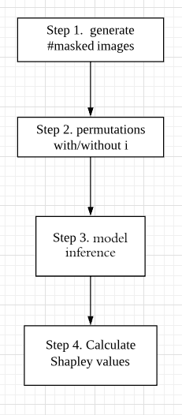

# Features Research

inference pipline based on reference: [links:https://github.com/balancap/SSD-Tensorflow]
Shapley calculation followed by reference: [links:https://arxiv.org/abs/1705.07874]
**Installation**

Python environment

with a new python environment

make install

**Informations for Files**

object_detection : the offical library download from [here](https://github.com/tensorflow/models)

slim: same as above.

image source: imgs/dogs.jpg

Entry point is _shapley.py_

